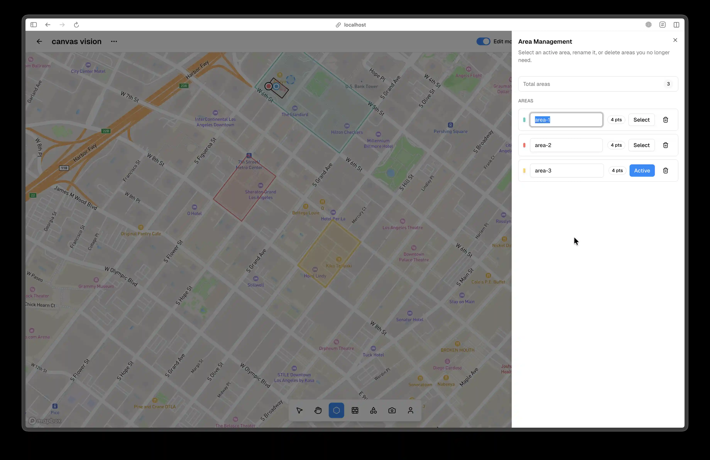

# Areas

Areas are mandatory spatial boundaries. You must create at least one area before placing walls, shapes, cameras, or people. When multiple areas exist, the most recently created or selected area becomes the active area for new placement.

To create an area in Point Mode, go to the bottom navigation and click Create Area, which is the second icon from the left, or press **A**. Click to add vertices around your boundary. A dashed preview line extends from the last vertex to your cursor, and you close the polygon by double-clicking, pressing Enter, or clicking the first vertex. Press **ESC** to cancel or Backspace to remove the last vertex. The cursor appears as a crosshair with a 12px blue dot, the first click shows a pulsing 10px dot, and vertices render as 8px circles. The preview line uses an 8px dash and 4px gap and animates toward the cursor. When you are close to the first vertex, a tooltip indicates that you can close and shows the total perimeter.

To create an area in Pen Mode, open the Create Area popover from the same bottom navigation tool, select Pen Mode, then click to place anchor points and drag from anchors to create Bezier control handles. Hold **Shift** to constrain handle angles in 45 degree steps and hold **Alt** for a sharp corner. The curve is sampled into a polyline for use throughout the app.

Area constraints are strict. A valid area must have at least three vertices and be a closed polygon, and all object placement is clipped to the active area. If you try to draw or place outside the area, the preview turns red and the cursor becomes not-allowed.

The first-time experience includes a centered prompt that says Create an Area to Begin, a guided tutorial for vertex placement and closing, and a confetti burst with a success toast when the first area is created. Tool buttons for walls, shapes, cameras, and people become enabled after the first area exists.

Area Management is available in the right sidebar. Click the Area Management button, which is the second button from the top, or use **Cmd+Shift+A** to open the slide-over panel. The panel lists areas with names, point counts, and color indicators. Click a row to make that area active and focus the viewport on it. Use the name field in the row to rename the area, and use the delete action in the row to remove it. If you delete the active area, the app selects the most recently created remaining area.

Overlapping areas show a faint crosshatch pattern. The active area is highlighted with a thicker border, and new objects are created inside it. Area names are formatted sequentially, such as Area 1, Area 2, and so on, and those names appear in the area list and in selection tooltips.

During drawing, measurement tooltips show the current segment length, and the final perimeter is shown when you close the polygon. In Canvas Mode, the grid provides scale reference with 1m by 1m minor squares, major grid lines every 10m, and coordinate labels at major grid lines.

<!-- Screenshot: Place docs/assets/screenshots/editor-areas-management.webp and capture: Area drawing with Area Management panel open. -->

