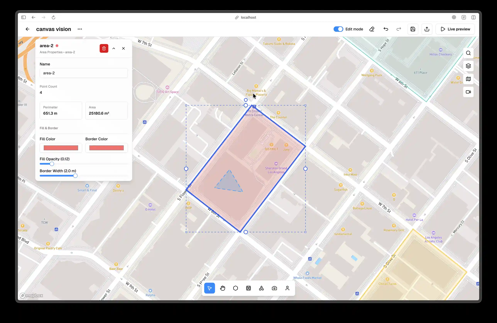

# Selection and Transform

Selection and transform tools let you move, resize, and rotate objects inside areas. Hand Mode enables map drag and disables selection, while Selector Mode enables selection and disables map drag. To change modes, open the Mode popover at the far left of the bottom navigation and choose Hand or Selector, or press **H** and V.

To select an object, switch to Selector Mode and click the object in the viewport. Shift-click to multi-select and click blank space to deselect. Selection priority is People, then Cameras, then Walls, then Shapes, then Areas, so the topmost item is always chosen first. On hover, the cursor changes to a pointer, the object outline glows, and a tooltip shows the object type and ID after a short delay of about 500ms.

Multi-select shows a selection count badge near the top-left of the viewport and enables bulk actions such as delete and duplicate. If your build includes a context menu, right-clicking a selection opens those actions. Delete can also be triggered with the Delete or Backspace key when the viewport has focus.

When an object is selected, a bounding box and transform handles appear around it. Corner handles resize diagonally, edge handles resize horizontally or vertically, and holding Shift keeps proportions. The rotation handle allows free rotation and snaps to 15 degree increments by default, with a tooltip showing the current angle. Hold **Shift** while rotating to disable snapping in builds that support free rotation.

When you drag a selected object, it must remain inside the active area. As you approach the boundary, previews turn red and the cursor becomes not-allowed. People cannot overlap walls, shapes, or other people at any time, and invalid drag positions snap back to the last valid position on release. Cursor feedback is consistent: hover uses a pointer, dragging uses a move cursor, resize uses directional resize cursors, rotation uses a rotate cursor, and invalid states use not-allowed with a red preview.

<!-- Screenshot: Place docs/assets/screenshots/editor-selection-transform.webp and capture: Selected object showing bounding box, resize handles, and rotation handle. -->
<!--  -->
