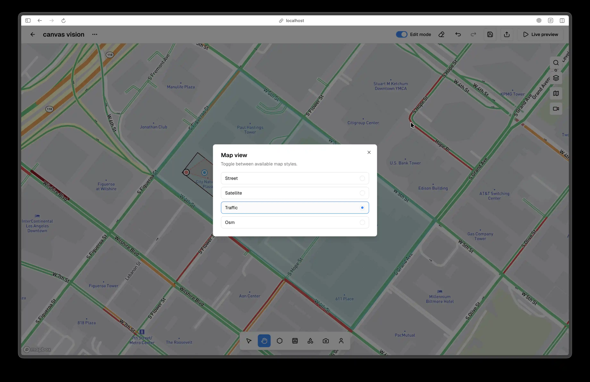

# Map Style and Search

Map styles apply only in Map Mode. To switch to Map Mode, use the Map and Canvas toggle in the top-left of the editor top bar. Once Map Mode is active, click Map Style in the right sidebar, which is the third button from the top, to open the style dialog. The dialog appears near the center of the screen and lists street, satellite, traffic, and osm. Select a style and the map updates immediately. The selected style is stored in the scene and restored on reload.

Map visibility is controlled by the Map View toggle next to the Map and Canvas switch. Turning Map View off hides tiles and shows a neutral grid. Canvas Mode uses a grid background as its default. Plans describe two grid behaviors: a visual-only grid when map tiles are hidden and a Mapbox grid style that thins out as you zoom out. If your build uses the grid style variant, you will see fewer grid lines at lower zoom levels.

Location Search is Map Mode only. Click Search Location in the right sidebar, which is the top button, or press **Cmd+K** or **Ctrl+K**. Type a location name, wait for results after a short debounce, and select a result to fly the map to that location. The dialog shows loading and empty states, results include name and context, and results are typically limited to a small set for speed. Press **ESC** to close the dialog.

Map tiles require a valid Mapbox token provided by your deployment. If Map Mode shows a blank background, switch to Canvas Mode to continue working and ask your administrator to confirm map tile access for your environment.

<!-- Screenshot: Place docs/assets/screenshots/editor-map-style-dialog.webp and capture: Map Mode with Map Style dialog open. -->
<!--  -->
