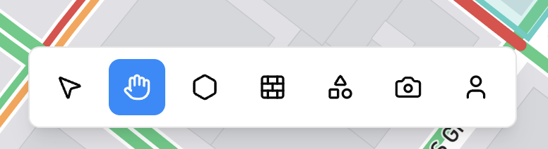

# Keyboard Shortcuts

Shortcuts are available when the viewport is focused and the Editor is active. You can always access the same tools from the bottom navigation and right sidebar if you prefer clicking.

Use **V** for Selector mode and **H** for Hand mode. Create Area is **A**, Draw Wall is **W**, Rectangle is **R**, Circle is **C**, Triangle is **T**, Line is **L**, Place Device is **D**, and Place Person is **P**. Search Location is **Cmd+K** or **Ctrl+K** and can also be opened from the top button in the right sidebar when Map Mode is active. Area Management is **Cmd+Shift+A** or **Ctrl+Shift+A** and opens the second button in the right sidebar. Devices in Use is **Cmd+Shift+D** or **Ctrl+Shift+D** and opens the fourth button in the right sidebar. Use **ESC** to cancel the current action or close a panel.

Undo is **Cmd+Z** or **Ctrl+Z** and Redo is **Cmd+Shift+Z** or **Ctrl+Shift+Z**, and both are also available in the top bar center. When a camera is selected, arrow keys adjust pan and tilt, and **plus** or **minus** adjusts zoom. These PTZ controls are mirrored in the camera properties panel on the right.

<!-- Screenshot: Place docs/assets/screenshots/editor-bottom-toolbar.webp and capture: Bottom tool strip showing all tools. -->
<!--  -->
