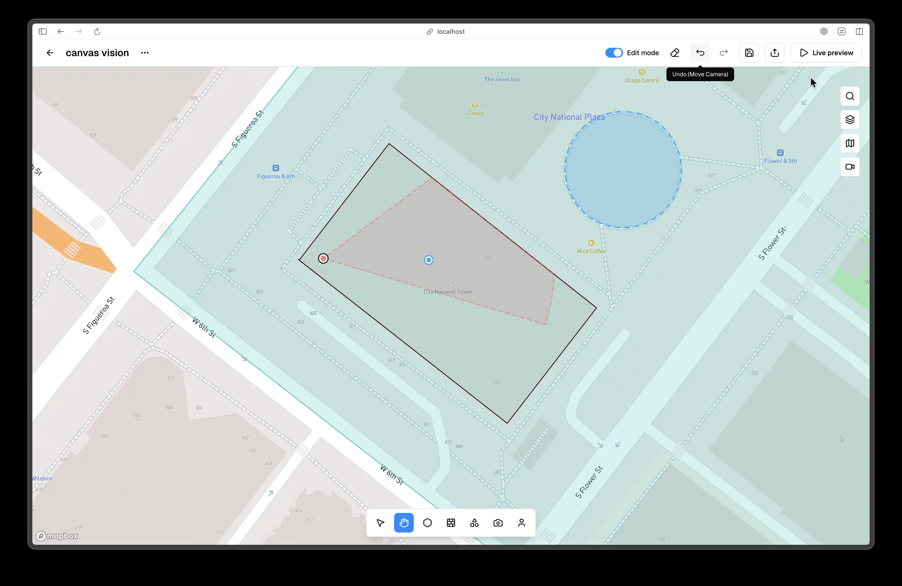

# Undo and Redo

Undo and redo record all meaningful scene edits and let you step backward or forward safely. Create, update, and delete operations are recorded for areas, walls, shapes, cameras, and people, along with scene-affecting style changes such as map style. Selection-only changes, view mode switches, and popover open states are not recorded.

Use the Undo and Redo buttons in the top bar center, or press Cmd+Z or Ctrl+Z to undo and Cmd+Shift+Z or Ctrl+Shift+Z to redo. Continuous gestures create a single history entry on gesture end, so dragging or resizing does not flood the stack. Undo and redo are disabled in Preview mode and when Edit Mode is off. If an object no longer exists after undo or redo, the selection is cleared.

Clear Board sits next to Undo and Redo in the top bar center in builds that include it. Clearing the board removes all objects in the current scene and resets the undo stack after confirmation, so use Undo before clearing if you want to preserve history.

<!-- Screenshot: Place docs/assets/screenshots/editor-undo-redo.webp and capture: Top bar center showing Clear Board, Undo, and Redo. -->

