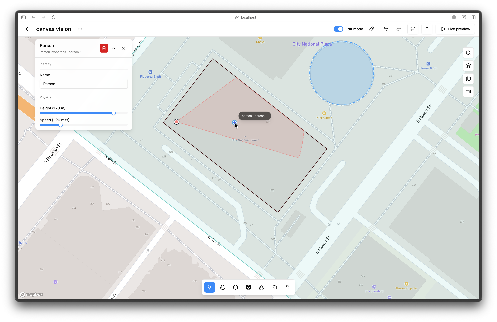

# People

People are actors in the simulation. They are placed inside areas and cannot overlap obstacles or other people, so they always respect the space you design.

To place a person, go to the bottom navigation and click Place Person, which is the sixth icon from the left, or press **P**, move the cursor inside an area, and click a valid position. The cursor shows a person icon with a collision radius preview. The default radius is 0.3m, which is a 0.6m diameter. A blue preview indicates valid placement, while a red preview and not-allowed cursor indicate invalid placement.

Placement validation checks that the position is inside the active area, does not overlap walls or shapes, and does not overlap other people. If invalid, a tooltip explains the reason and clicking can trigger a short shake animation and an error toast.

On placement, a fade-in and pulse animation plays, the properties panel opens automatically on the right, and you can immediately drag to adjust position. Collision rules remain active during dragging, so people cannot be dragged through obstacles.

Person properties include name, height, speed, and behavior and trail settings used by the simulation. These fields are in the properties panel on the right when a person is selected. In Preview, clicking a person in the 3D view or in radar highlights the person and shows a trailing path, so you can verify movement patterns.

<!-- Screenshot: Place docs/assets/screenshots/editor-person-placement.webp and capture: Person placement or selected person with properties panel open. -->

