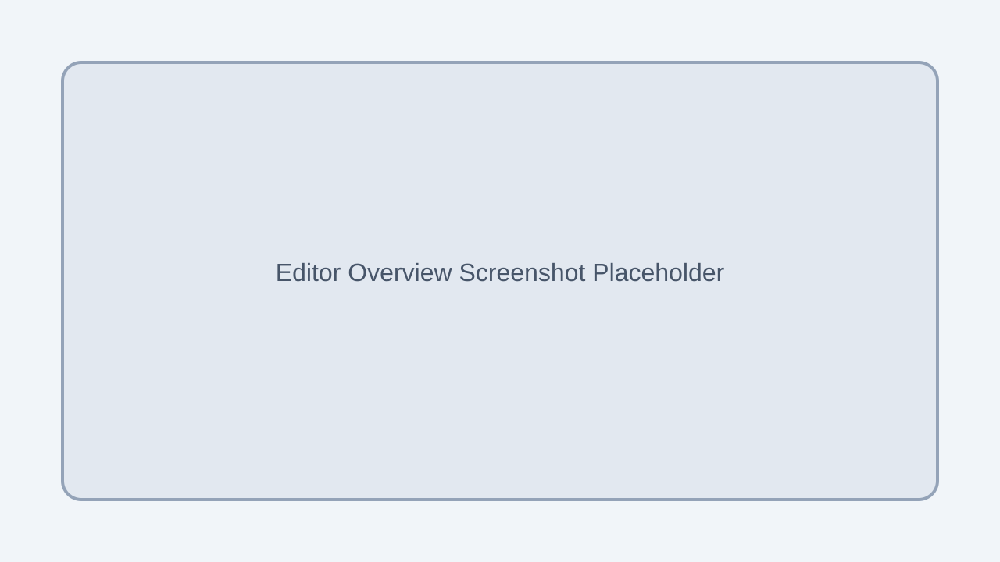
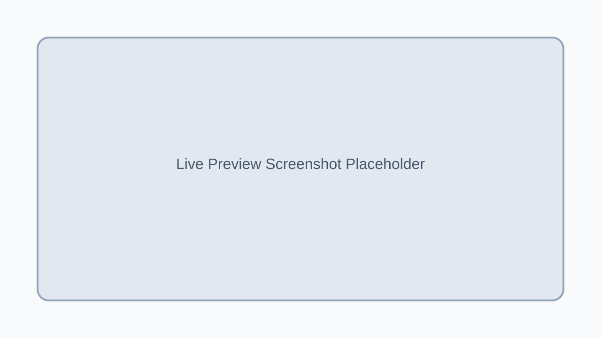
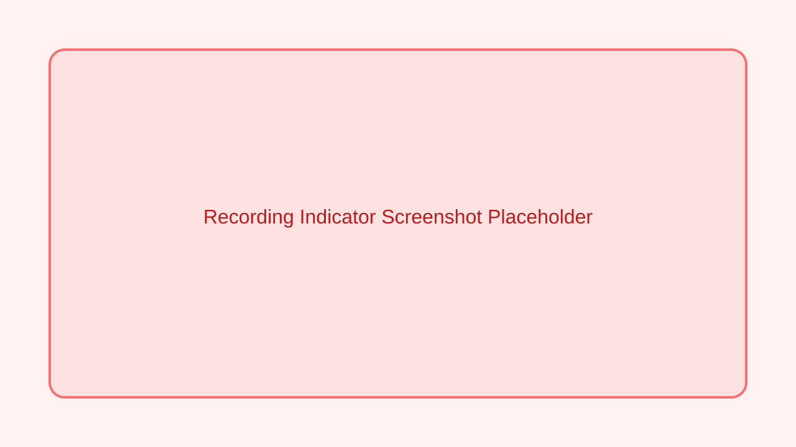

# User Guide

This guide walks through the editor, live preview, recording, and export workflows.

## Editor Overview

The editor is where you build and tune your scene.

- **Top bar**: switch Map/Canvas modes, undo/redo, export, and launch Live Preview.
- **Left viewport**: draw areas, walls, and shapes, or place cameras and people.
- **Right rail**: quick access to search, map styles, devices, and area management.
- **Properties sheets**: edit selected area, wall, shape, person, or camera attributes.

## Map and Canvas Modes

- **Map mode** uses the Mapbox basemap and overlays your geometry.
- **Canvas mode** provides a neutral grid for quick layout work.

## Live Preview (3D)

Live Preview is the 3D simulation view. Use the top bar to:

- Toggle **Map/Canvas** background textures.
- Filter to a specific **Area**.
- Start/stop **Recording**.
- Capture a **Snapshot**.

## Recording

- Click **Start Recording** to capture the 3D simulation at 30 FPS.
- While recording, a **REC** timer appears in the top bar and a persistent indicator shows in the viewport.
- Click **Stop Recording** to download a WebM file.

## Snapshots

- Click **Snapshot** in Live Preview to capture a high-resolution PNG (2x the viewport).
- A white flash confirms capture, followed by a success toast.

## Exports

From the editor top bar:

- **Scene JSON** exports the entire scene as a `.json` file.
- **Scene Image** exports a PNG of the current 2D map view (Map mode).

## Radar & Camera Feeds

- The Radar panel shows people, cameras, and FOV wedges in real time.
- Camera feeds show detections and label overlays per camera.

## Notes About Screenshots

The images in this guide are placeholders. Replace them with real captures from your environment for final documentation.
