# Getting Started End-to-End

This workflow is a step-by-step build that mirrors how new users should learn the product. Follow each step in order, capture the screenshot after each step, and move to the next step only after the UI matches the description.

Step 1: Open the Editor View and decide whether to use Map Mode or Canvas Mode. The Map and Canvas toggle is in the top-left of the top bar. If you choose Map Mode, open Search Location from the top button in the right sidebar or press Cmd+K, then search for a location and select a result so the map flies to that area.

<!-- Screenshot: Place docs/assets/screenshots/workflow-step-01-editor-start.webp and capture: Editor View with Map or Canvas selected and the location set if Map Mode is used. -->
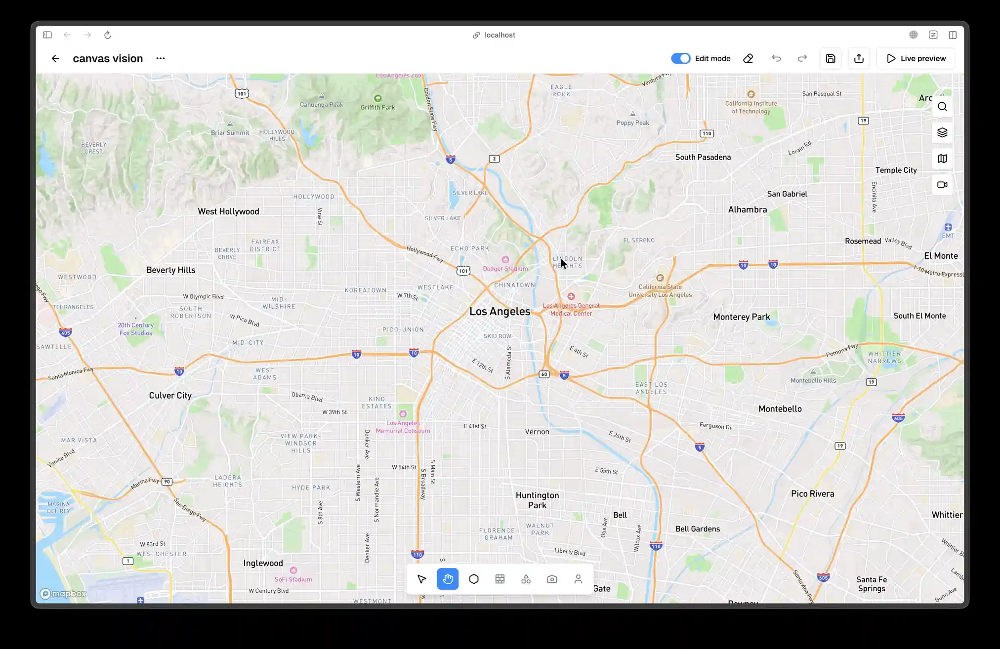

Step 2: Create the first area. Click Create Area in the bottom tool strip, which is the second icon from the left, or press A. Click to place vertices around your space, then double-click or press Enter to close the polygon. The area border should appear and the other tools should become enabled.

<!-- Screenshot: Place docs/assets/screenshots/workflow-step-02-area-drawn.webp and capture: Completed area with the active area highlighted. -->
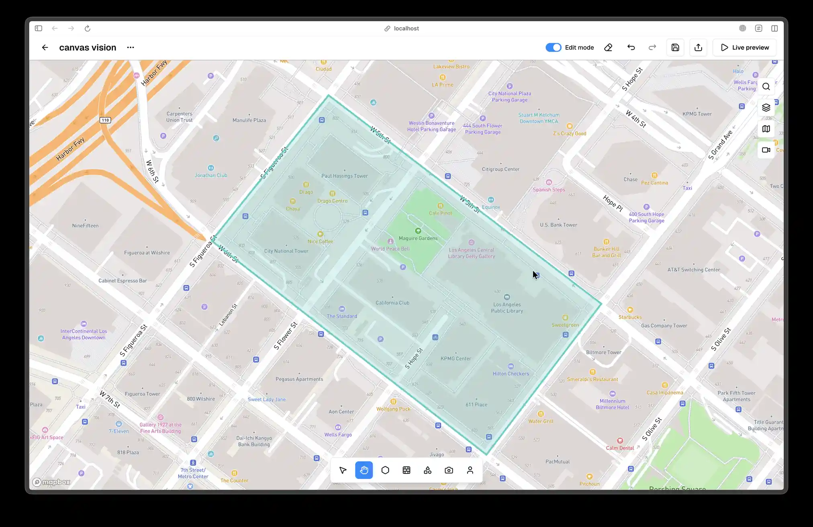

Step 3: Draw a wall if your space has structural boundaries or occlusion. Click Draw Wall in the bottom tool strip, which is the third icon from the left, or press W. Click to place points and double-click to finish. If your project does not need walls, skip to Step 5 and leave this screenshot empty.

<!-- Screenshot: Place docs/assets/screenshots/workflow-step-03-wall-drawn.webp and capture: Wall drawn inside the area with a measurement tooltip visible if possible. -->
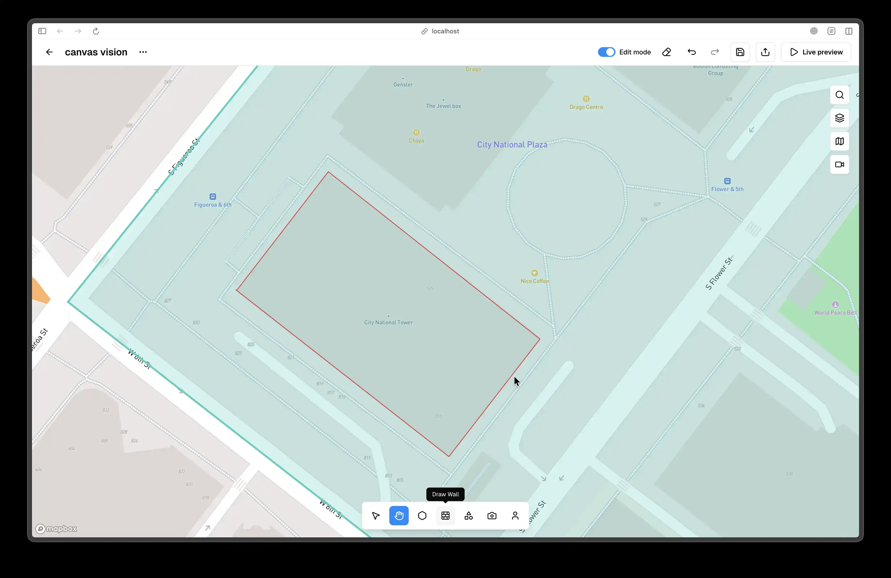

Step 4: Select the wall and confirm its properties panel is visible. Open the Mode popover at the far left of the bottom tool strip and choose Selector Mode, or press V, then click the wall and verify the right-side properties panel shows wall length, thickness, height, and color controls.

<!-- Screenshot: Place docs/assets/screenshots/workflow-step-04-wall-properties.webp and capture: Selected wall with the properties panel open. -->
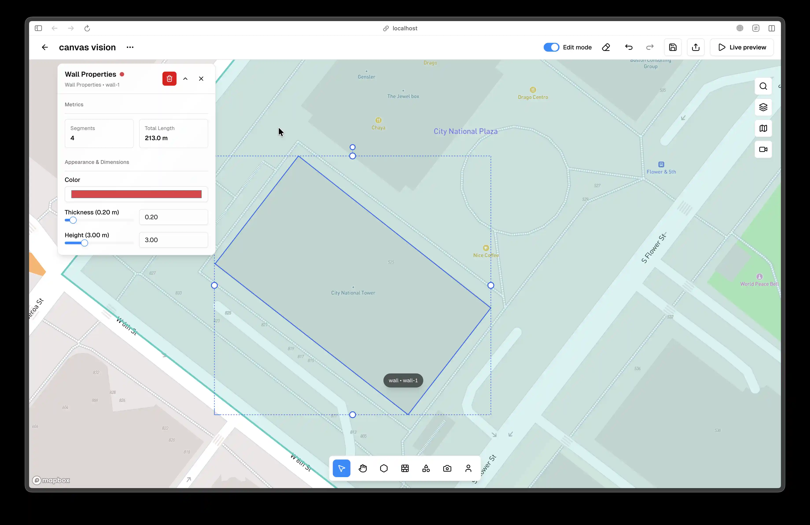

Step 5: Draw a shape if your space has furniture or obstacles. Click Draw Shapes in the bottom tool strip, choose a shape, and draw it inside the area. If your project does not need shapes, skip to Step 6 and leave this screenshot empty.

<!-- Screenshot: Place docs/assets/screenshots/workflow-step-05-shape-drawn.webp and capture: A shape drawn inside the area. -->
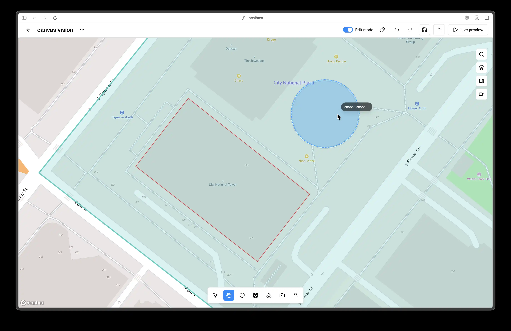

Step 6: Place a camera. Click Place Device in the bottom tool strip, which is the fifth icon, or press D. Select a camera type in the Device Picker, then click inside the area to place it. Ensure the FOV wedge is visible in the viewport.

<!-- Screenshot: Place docs/assets/screenshots/workflow-step-06-camera-placed.webp and capture: Camera placed with the FOV wedge visible. -->
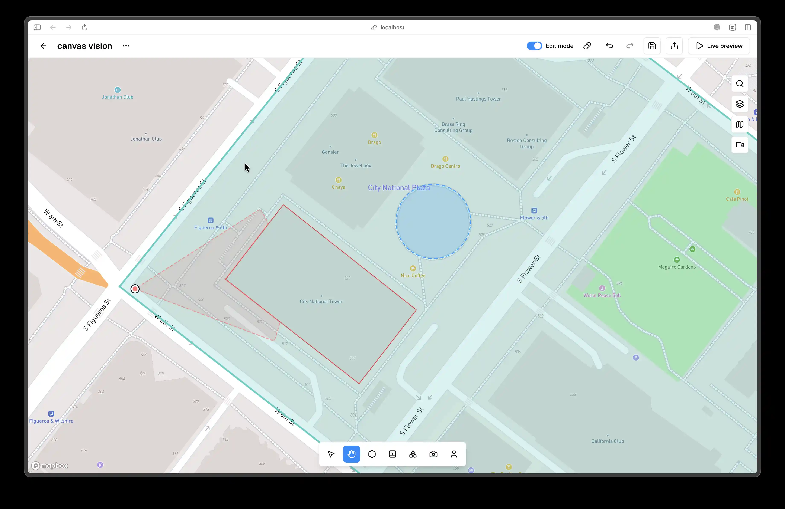

Step 7: Open the camera properties panel. With the camera selected, verify the properties panel shows PTZ controls, optics settings, and color. Adjust pan or zoom slightly so the FOV wedge changes.

<!-- Screenshot: Place docs/assets/screenshots/workflow-step-07-camera-properties.webp and capture: Camera selected with the properties panel open and PTZ controls visible. -->
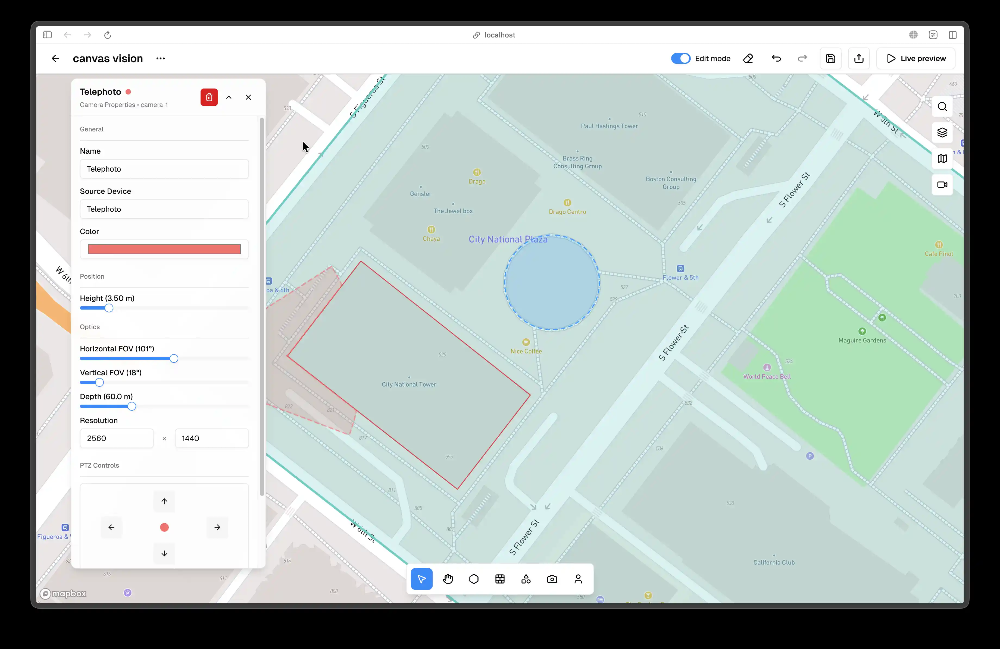

Step 8: Place a person. Click Place Person in the bottom tool strip, which is the sixth icon, or press P. Click a valid spot inside the area and confirm the person appears.

<!-- Screenshot: Place docs/assets/screenshots/workflow-step-08-person-placed.webp and capture: Person placed inside the area. -->
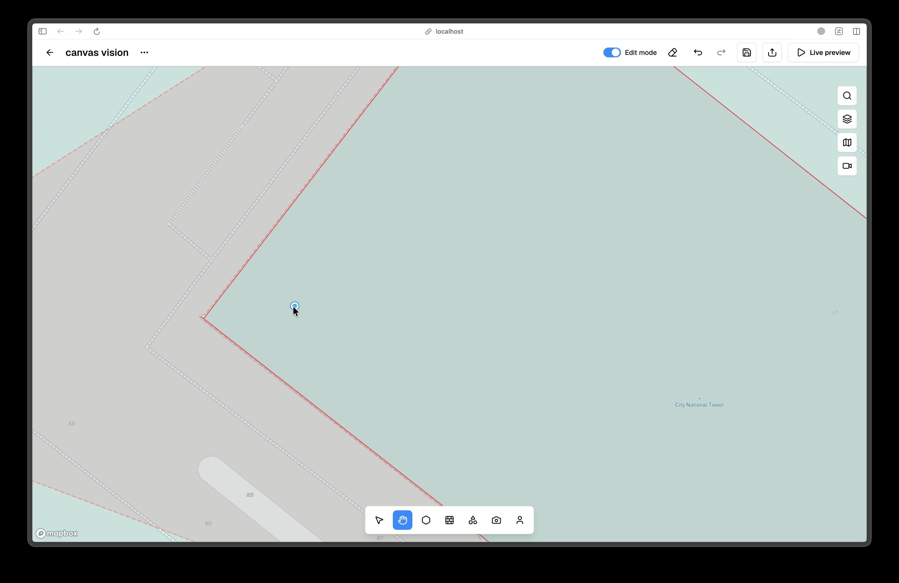

Step 9: Open the person properties panel. Select the person and confirm the right-side panel shows name, height, speed, and behavior settings.

<!-- Screenshot: Place docs/assets/screenshots/workflow-step-09-person-properties.webp and capture: Person selected with the properties panel open. -->
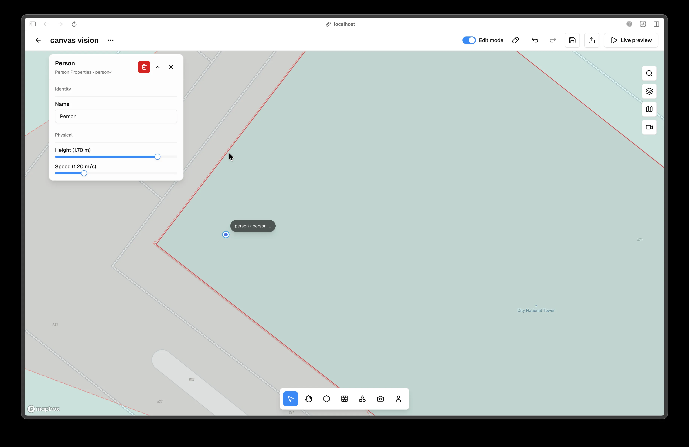

Step 10: Demonstrate movement and transform. Open the Mode popover at the far left of the bottom tool strip and choose Selector Mode, or press V, then drag one object to a new position inside the active area and show its transform handles. This verifies map movement and constraint behavior.

<!-- Screenshot: Place docs/assets/screenshots/workflow-step-10-selection-move.webp and capture: Selected object with transform handles and a moved position. -->
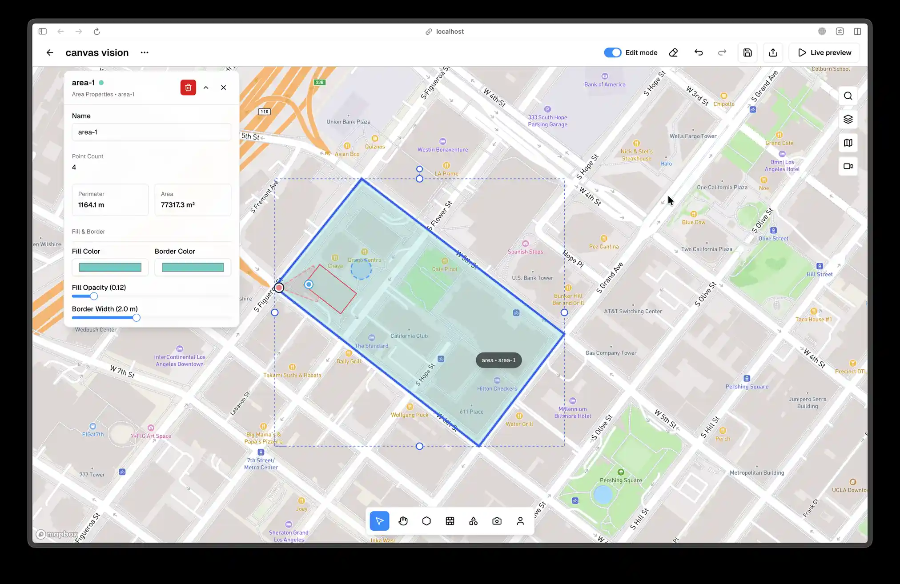

Step 11: Enter Simulation Analysis by clicking Live Preview in the top bar on the right. Confirm the radar overlay appears in the upper-left and the camera list appears in the right sidebar.

<!-- Screenshot: Place docs/assets/screenshots/workflow-step-11-preview-overview.webp and capture: Simulation Analysis with top bar, radar, and right sidebar visible. -->
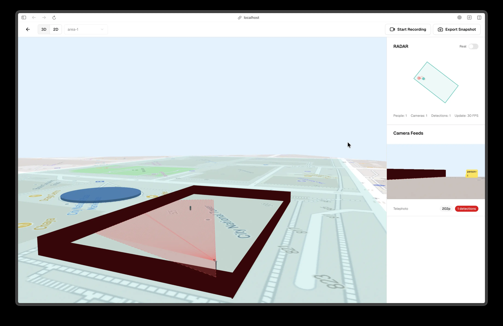

Step 12: Start a recording if the feature is available. Click Start Recording in the top bar on the right and confirm the timer appears. If recording is not enabled in your deployment, skip this step and leave the screenshot empty.

<!-- Screenshot: Place docs/assets/screenshots/workflow-step-12-recording.webp and capture: Recording active with the timer visible. -->

Step 13: Capture a snapshot if the feature is available. Click Snapshot in the top bar on the right and confirm the flash or download occurs. If snapshots are not enabled, skip this step and leave the screenshot empty.

<!-- Screenshot: Place docs/assets/screenshots/workflow-step-13-snapshot.webp and capture: Snapshot action visible or confirmation state. -->
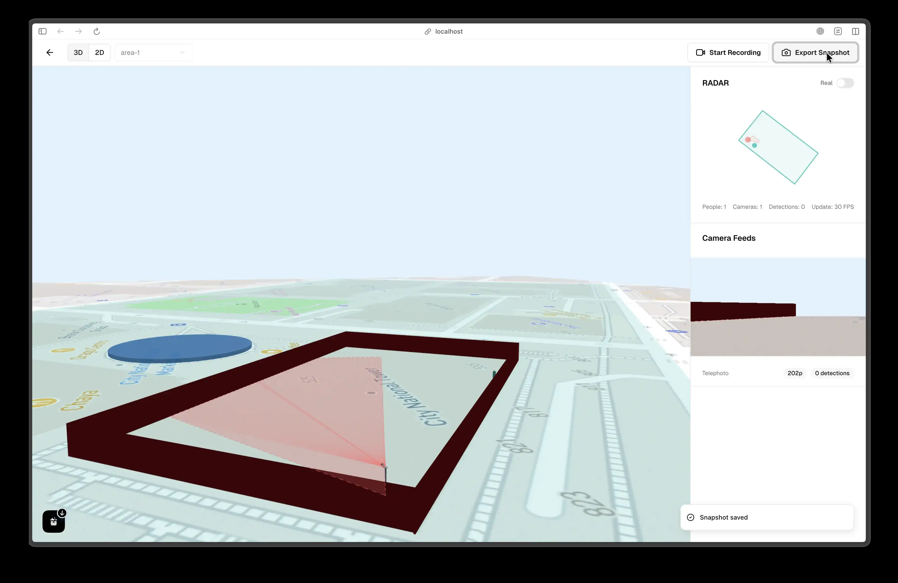

Step 14: Return to the Editor and export Scene JSON if the export menu is available. Click Back to Editor in the Preview top bar on the left, then open the Export dropdown in the editor top bar on the right and choose Scene JSON. If export is not enabled, skip this step and leave the screenshot empty.

<!-- Screenshot: Place docs/assets/screenshots/workflow-step-14-export-scene-json.webp and capture: Export dropdown open with Scene JSON visible. -->

