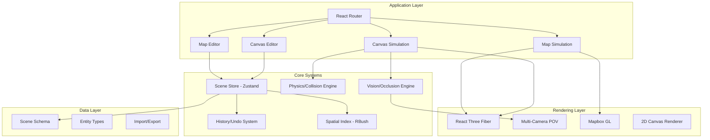
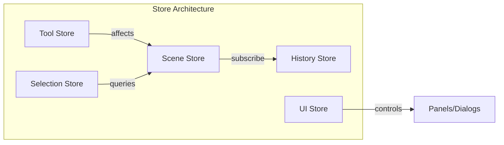
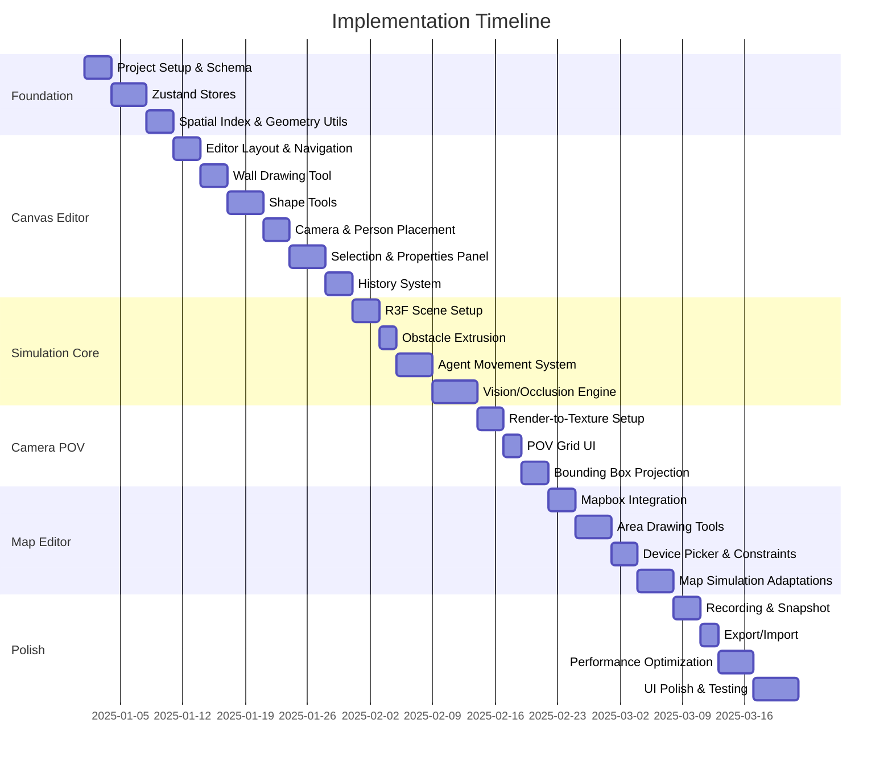

# Computer Vision Simulator - Complete Implementation Plan

## Architecture Overview



---

## Phase 1: Project Foundation

### 1.1 Project Setup and Configuration

**Stack:**

- Vite + React 18 + TypeScript
- React Three Fiber + Drei (Three.js helpers)
- Zustand (state management)
- React Router v6
- shadcn/ui + Tailwind CSS
- cmdk (command palette)
- Mapbox GL JS
- rbush (spatial indexing)

**Project Structure:**

```javascript
src/
├── app/
│   ├── routes/
│   │   ├── canvas-editor.tsx
│   │   ├── canvas-preview.tsx
│   │   ├── map-editor.tsx
│   │   └── map-preview.tsx
│   └── layout.tsx
├── core/
│   ├── schema/
│   │   ├── entities.ts          # Wall, Shape, Camera, Person, Area
│   │   ├── scene.ts             # Scene root schema
│   │   └── validation.ts        # Zod schemas
│   ├── store/
│   │   ├── scene-store.ts       # Main Zustand store
│   │   ├── history-store.ts     # Undo/redo system
│   │   ├── tool-store.ts        # Active tool state
│   │   └── selection-store.ts   # Selection state
│   ├── physics/
│   │   ├── collision.ts         # Collision detection
│   │   ├── spatial-index.ts     # RBush wrapper
│   │   └── movement.ts          # Agent steering/avoidance
│   └── vision/
│       ├── raycasting.ts        # 2D ray casting
│       ├── occlusion.ts         # Height-aware occlusion
│       └── visibility-polygon.ts # Camera FOV polygon
├── features/
│   ├── canvas-editor/
│   │   ├── components/
│   │   │   ├── canvas-board.tsx
│   │   │   ├── grid-background.tsx
│   │   │   ├── wall-tool.tsx
│   │   │   ├── shape-tool.tsx
│   │   │   ├── camera-tool.tsx
│   │   │   ├── person-tool.tsx
│   │   │   └── selection-handles.tsx
│   │   ├── hooks/
│   │   │   ├── use-draw-wall.ts
│   │   │   ├── use-draw-shape.ts
│   │   │   └── use-pan-zoom.ts
│   │   └── index.tsx
│   ├── map-editor/
│   │   ├── components/
│   │   │   ├── map-container.tsx
│   │   │   ├── area-draw-tool.tsx
│   │   │   ├── device-picker.tsx
│   │   │   └── map-controls.tsx
│   │   └── index.tsx
│   ├── simulation/
│   │   ├── components/
│   │   │   ├── simulation-viewport.tsx
│   │   │   ├── scene-3d.tsx
│   │   │   ├── camera-pov-grid.tsx
│   │   │   ├── person-agent.tsx
│   │   │   └── trail-renderer.tsx
│   │   ├── hooks/
│   │   │   ├── use-simulation-loop.ts
│   │   │   ├── use-camera-render-target.ts
│   │   │   └── use-agent-movement.ts
│   │   └── index.tsx
│   ├── properties-panel/
│   │   ├── camera-properties.tsx
│   │   ├── wall-properties.tsx
│   │   ├── shape-properties.tsx
│   │   └── person-properties.tsx
│   └── recording/
│       ├── use-recording.ts
│       └── snapshot.ts
├── ui/
│   └── [shadcn components]
└── lib/
    ├── geometry.ts              # Intersection math, transforms
    ├── constants.ts             # Default values
    └── utils.ts
```

### 1.2 Entity Schema Design (TypeScript)

```typescript
// Core entity types with full type safety
interface BaseEntity {
  id: string;
  createdAt: number;
  updatedAt: number;
}

interface WallSegment extends BaseEntity {
  type: "wall";
  x1: number;
  y1: number;
  x2: number;
  y2: number;
  height: number; // meters
  thickness: number; // meters
  color: string;
  opacity: number;
}

interface Shape extends BaseEntity {
  type: "rectangle" | "circle" | "triangle" | "line";
  x: number;
  y: number;
  rotation: number; // degrees
  width: number;
  length: number;
  height: number;
  color: string;
  opacity: number;
  blocksMovement: boolean;
  blocksVision: boolean;
}

interface Camera extends BaseEntity {
  type: "camera";
  preset: "basic" | "wide" | "telephoto" | "panoramic" | "indoor" | "outdoor";
  x: number;
  y: number;
  height: number; // meters
  direction: number; // degrees 0-360
  fov: number; // degrees
  depth: number; // meters
  zoom: number;
  nearPlane: number;
  resolution: [number, number];
}

interface Person extends BaseEntity {
  type: "person";
  x: number;
  y: number;
  radius: number;
  height: number;
  speed: number;
  behavior: "roam" | "path" | "stationary";
}

interface Area extends BaseEntity {
  type: "area";
  name: string;
  points: [number, number][]; // Polygon vertices
  bezierHandles?: BezierHandle[];
  fillColor: string;
  fillOpacity: number;
  borderColor: string;
  borderWidth: number;
}
```

---

## Phase 2: Core Systems Implementation

### 2.1 Zustand Store Architecture



**Scene Store** - Central source of truth:

- Entities: `Map<string, Entity>` for O(1) lookups
- Spatial index reference for fast queries
- CRUD operations that trigger history commits

**History Store** - Command-based undo/redo:

- Stack of reversible commands
- Debounced property edits (300ms idle)
- Max 200 operations (configurable)

**Tool Store** - Active tool state:

- Current tool: 'select' | 'wall' | 'shape' | 'camera' | 'person'
- Shape subtype when shape tool active
- Drawing state (in-progress wall points, etc.)

### 2.2 Spatial Indexing (RBush)

Use RBush for O(log n) spatial queries:

```typescript
interface SpatialIndex {
  insert(entity: Entity): void;
  remove(entity: Entity): void;
  update(entity: Entity): void;
  queryRect(bounds: BBox): Entity[];
  queryRadius(center: Point, radius: number): Entity[];
  queryRay(origin: Point, direction: Vector, maxDist: number): RayHit[];
}
```

Required for:

- Fast obstacle lookup during collision detection
- Camera visibility queries (candidates in FOV)
- Click-to-select hit testing
- Drawing constraint validation

### 2.3 Physics and Collision System

**Collision Shapes:**

- Walls: Line segments with thickness (capsule collision)
- Rectangles: OBB (oriented bounding box)
- Circles: Circle collision
- Triangles: Polygon collision
- People: Circle collision

**Movement System (RVO-lite):**

```typescript
interface AgentState {
  position: Vector2;
  velocity: Vector2;
  preferredVelocity: Vector2;
  radius: number;
  maxSpeed: number;
}

function computeNewVelocity(
  agent: AgentState,
  neighbors: AgentState[],
  obstacles: Obstacle[],
  dt: number
): Vector2;
```

Key requirements:

- People avoid walls, shapes, and each other
- No tunneling through thin walls (small timestep: 16ms)
- Steering behaviors for natural-looking movement
- Boundary constraints (canvas bounds or area polygon)

### 2.4 Vision and Occlusion Engine

**2D Visibility Polygon Algorithm:**

1. Define FOV wedge from camera position
2. Cast N rays (default 400) across FOV arc
3. For each ray, find closest obstacle intersection
4. Build polygon fan from hit points

```typescript
function computeVisibilityPolygon(
  camera: Camera,
  obstacles: Obstacle[],
  spatialIndex: SpatialIndex
): Vector2[];
```

**Height-aware Occlusion:**

```typescript
function isPersonVisible(
  camera: Camera,
  person: Person,
  obstacles: Obstacle[]
): { visible: boolean; occludedBy?: Obstacle };
```

Check if obstacle height blocks the line-of-sight considering:

- Camera height
- Person height (default 1.7m)
- Obstacle height at intersection point

---

## Phase 3: Canvas Editor Implementation

### 3.1 Editor Layout

```javascript
+--------------------------------------------------+
|  [Edit Mode] [Clear] [Undo] [Redo] [Export] [▶]  |  <- Top Bar
+--------------------------------------------------+
|                                                  |
|                                                  |
|              Checkered Grid Board                |
|              (pan/zoom enabled)                  |
|           Camera cones rendered here             |
|                                                  |
|                                                  |
+--------------------------------------------------+
|  [Select] [Wall] [Shapes▾] [Camera] [Person] [📷]|  <- Bottom Nav
+--------------------------------------------------+
```

**Right Panel** (when object selected):

- Object type header with ID
- Property fields with live validation
- Instant apply on change

### 3.2 Drawing Tools Implementation

**Wall Tool:**

- Click to start, click to add points, double-click to finish
- Preview line follows cursor
- Show length in meters near cursor
- Snap-to-grid option (configurable grid size)
- Store as polyline, compile to segments for physics

**Shape Tool (Popover submenu):**

- Rectangle: Click-drag to size, handles for resize/rotate
- Circle: Click-drag radius
- Triangle: Click-drag bounding box
- Line: Click-drag endpoints

**Camera Tool:**

- Click to place at cursor
- Immediately render FOV cone (occlusion-aware)
- Default preset: 'basic' (FOV: 60, depth: 20m, height: 2.5m)

**Person Tool:**

- Click to place (validate not on obstacle)
- Show collision radius preview
- Reject/nudge if overlapping

### 3.3 Selection and Manipulation

**Z-order priority (top = highest):**

1. People
2. Cameras
3. Walls
4. Shapes
5. Background

**Selection handles:**

- Corner handles for resize
- Rotation handle (arc drag)
- Center handle for move
- Property panel opens on selection

### 3.4 Background Image Tool

- Upload image via file picker
- Properties: opacity, scale (m/px), rotation, position
- Lock toggle to prevent accidental moves
- Renders behind all objects

---

## Phase 4: 3D Simulation (Canvas Preview)

### 4.1 React Three Fiber Scene Structure

```tsx
<Canvas>
  <OrbitControls />
  <ambientLight intensity={0.4} />
  <directionalLight position={[10, 20, 10]} />

  {/* Ground */}
  <GridFloor size={100} />

  {/* Extruded obstacles */}
  {walls.map((wall) => (
    <WallMesh key={wall.id} wall={wall} />
  ))}
  {shapes.map((shape) => (
    <ShapeMesh key={shape.id} shape={shape} />
  ))}

  {/* Cameras (visual representation) */}
  {cameras.map((cam) => (
    <CameraModel key={cam.id} camera={cam} />
  ))}

  {/* Animated people */}
  {people.map((person) => (
    <PersonAgent
      key={person.id}
      person={person}
      selected={selectedId === person.id}
    />
  ))}

  {/* Per-camera render targets for POV feeds */}
  {cameras.map((cam) => (
    <CameraPOVRenderer key={cam.id} camera={cam} />
  ))}
</Canvas>
```

### 4.2 Multi-Camera POV Rendering

Use React Three Fiber's `createPortal` and `useFrame` for render-to-texture:

```tsx
function CameraPOVRenderer({ camera }: { camera: Camera }) {
  const renderTarget = useFBO(camera.resolution[0], camera.resolution[1]);
  const povCamera = useMemo(() => {
    const cam = new THREE.PerspectiveCamera(
      camera.fov,
      aspectRatio,
      0.1,
      camera.depth
    );
    cam.position.set(camera.x, camera.height, camera.y);
    cam.rotation.y = THREE.MathUtils.degToRad(-camera.direction);
    return cam;
  }, [camera]);

  useFrame(({ gl, scene }) => {
    gl.setRenderTarget(renderTarget);
    gl.render(scene, povCamera);
    gl.setRenderTarget(null);
  });

  return <primitive object={renderTarget.texture} />;
}
```

### 4.3 Agent Movement Loop

```typescript
function useSimulationLoop() {
  const { people, obstacles } = useSceneStore();
  const spatialIndex = useSpatialIndex();

  useFrame((_, delta) => {
    for (const person of people) {
      // 1. Query nearby obstacles and agents
      const neighbors = spatialIndex.queryRadius(person.position, 5);

      // 2. Compute avoidance velocity (RVO)
      const newVelocity = computeNewVelocity(
        person,
        neighbors,
        obstacles,
        delta
      );

      // 3. Update position
      person.x += newVelocity.x * delta;
      person.y += newVelocity.y * delta;

      // 4. Record trail point (for selected person)
      if (person.id === selectedId) {
        trailPoints.push({ x: person.x, y: person.y, t: Date.now() });
      }
    }
  });
}
```

### 4.4 Person Selection and Bounding Boxes

When a person is clicked:

1. Highlight the person mesh
2. Show trail (last 20 seconds of movement)
3. For each camera where person is visible:

- Project person's 3D capsule bounds to camera's 2D viewport
- Draw bounding box overlay on POV feed tile

### 4.5 Recording and Snapshot

**Recording:**

```typescript
function useRecording() {
  const canvasRef = useThree((state) => state.gl.domElement);
  const mediaRecorderRef = useRef<MediaRecorder>();

  const startRecording = () => {
    const stream = canvasRef.captureStream(30);
    mediaRecorderRef.current = new MediaRecorder(stream, {
      mimeType: "video/webm",
    });
    // ...handle data chunks
  };
}
```

**Snapshot:**

```typescript
function takeSnapshot(gl: WebGLRenderer, resolution: number = 2) {
  const canvas = document.createElement("canvas");
  canvas.width = gl.domElement.width * resolution;
  canvas.height = gl.domElement.height * resolution;
  // Render at high resolution, convert to PNG blob
}
```

---

## Phase 5: Map Editor Implementation

### 5.1 Mapbox Integration

```tsx
function MapContainer() {
  const mapRef = useRef<mapboxgl.Map>();

  useEffect(() => {
    mapRef.current = new mapboxgl.Map({
      container: containerRef.current,
      style: "mapbox://styles/mapbox/satellite-v9",
      center: [0, 0],
      zoom: 2,
    });
  }, []);

  return (
    <div ref={containerRef}>
      {/* Overlay for drawing areas and objects */}
      <MapOverlay map={mapRef.current} />
    </div>
  );
}
```

### 5.2 Area Drawing Tools

**Point-to-point polygon:**

- Click to add vertices
- Preview line to cursor
- Double-click closes polygon
- Minimum 3 vertices required

**Pen tool (Bezier):**

- Click to add anchor
- Drag to create bezier handles
- Sample curves into polyline for physics
- Store original handles for editing

### 5.3 Placement Constraints

All placement (cameras, people, shapes, walls) must:

1. Check if point is inside any area polygon
2. If outside: cursor = `not-allowed`, click rejected
3. Use point-in-polygon algorithm (ray casting)

### 5.4 Device Picker (CMDK)

```tsx
function DevicePicker() {
  return (
    <Command>
      <Command.Input placeholder="Search devices..." />
      <Command.List>
        <Command.Group heading="Cameras">
          <Command.Item onSelect={() => selectDevice("basic")}>
            Basic Security Camera
          </Command.Item>
          <Command.Item onSelect={() => selectDevice("wide")}>
            Wide Angle Camera
          </Command.Item>
          {/* ... more presets */}
        </Command.Group>
        <Command.Group heading="Processors">
          {/* Placeholder items */}
        </Command.Group>
      </Command.List>
    </Command>
  );
}
```

### 5.5 Right-side Control Panel

1. **Search Location**: CMDK for geocoding, flyTo on select
2. **Area Management**: List areas with point counts, click to flyTo bounds
3. **Map Style Picker**: Satellite, Street, Traffic, OSM
4. **Devices List**: Grouped by area, click to select and open properties

---

## Phase 6: Map Simulation Preview

### 6.1 Layout Differences from Canvas Preview

- Area dropdown (top-left): Select area, triggers flyTo
- Map visibility toggle: Show/hide Mapbox texture under 3D
- 2D overlay: Camera cones and people positions on map layer
- Same camera POV grid in right sidebar

### 6.2 3D Scene with Map Ground

```tsx
function MapSimulation({ selectedArea }: { selectedArea: Area }) {
  const { mapTexture, bounds } = useMapTexture(selectedArea);

  return (
    <Canvas>
      {/* Ground plane with map texture */}
      <mesh rotation={[-Math.PI / 2, 0, 0]}>
        <planeGeometry args={[bounds.width, bounds.height]} />
        <meshBasicMaterial map={mapTexture} />
      </mesh>

      {/* Same scene content as Canvas simulation */}
      <SimulationContent />
    </Canvas>
  );
}
```

### 6.3 Area Boundary Constraints

People movement constrained to selected area polygon:

```typescript
function constrainToArea(position: Vector2, area: Area): Vector2 {
  if (pointInPolygon(position, area.points)) {
    return position;
  }
  // Find closest point on area boundary
  return nearestPointOnPolygon(position, area.points);
}
```

---

## Phase 7: History System (Undo/Redo)

### 7.1 Command Pattern Implementation

```typescript
interface Command {
  id: string;
  timestamp: number;
  execute(): void;
  undo(): void;
  description: string;
}

class AddEntityCommand implements Command {
  constructor(private entity: Entity) {}
  execute() {
    sceneStore.addEntity(this.entity);
  }
  undo() {
    sceneStore.removeEntity(this.entity.id);
  }
}

class UpdateEntityCommand implements Command {
  constructor(
    private entityId: string,
    private oldValues: Partial<Entity>,
    private newValues: Partial<Entity>
  ) {}
  execute() {
    sceneStore.updateEntity(this.entityId, this.newValues);
  }
  undo() {
    sceneStore.updateEntity(this.entityId, this.oldValues);
  }
}
```

### 7.2 Debounced Property Edits

For rapid input changes (typing, dragging sliders):

```typescript
const debouncedCommit = useDebouncedCallback((command: Command) => {
  historyStore.push(command);
}, 300);
```

---

## Phase 8: UI Components and Interactions

### 8.1 Required shadcn Components

- Button, Input, Slider (property editing)
- Popover (tool submenus, area management)
- Dialog (confirmations)
- Command (cmdk integration)
- Tooltip (tool hints)
- ScrollArea (panels)
- Toggle, ToggleGroup (mode switches)
- Tabs (camera POV grid organization)

### 8.2 Property Panel Fields

Numeric fields with:

- Step increments (e.g., 0.1m for positions, 1° for angles)
- Min/max validation
- Label drag-to-adjust (pro UX)
- Immediate application

### 8.3 Cursor States

| Context | Cursor |

|---------|--------|

| Default | `default` |

| Pan/Hand mode | `grab` / `grabbing` |

| Draw wall/shape | `crosshair` |

| Place camera | Custom camera icon |

| Place person | Custom person icon |

| Invalid area | `not-allowed` |

| Resize handle | `nwse-resize` etc. |

| Rotate handle | Custom rotate icon |

### 8.4 Closing UI Overlays

Close on:

- Click on empty canvas/map
- ESC key
- Tool switch
- Click on nav buttons

Applies to: Properties panel, popovers, CMDK dialogs, area management---

## Phase 9: Export and Import

### 9.1 Scene JSON Schema

```json
{
  "version": "1.0",
  "mode": "canvas",
  "units": "meters",
  "background": { "url": "...", "opacity": 0.8, "scale": 0.05 },
  "areas": [],
  "walls": [...],
  "shapes": [...],
  "cameras": [...],
  "people": [...],
  "meta": { "createdAt": "...", "updatedAt": "..." }
}
```

### 9.2 Export Functions

```typescript
function exportSceneJSON(scene: Scene): Blob;
function exportSceneImage(gl: WebGLRenderer): Promise<Blob>; // Top-down PNG
function exportRecording(chunks: BlobPart[]): Blob; // WebM video
```

---

## Phase 10: Performance Optimization

### 10.1 Targets

- Editor: 60 FPS with 500 objects
- Preview: 60 FPS with 20 cameras @ 720p, 30 people, 200 obstacles

### 10.2 Strategies

1. **Spatial indexing**: RBush for all collision/visibility queries
2. **Camera POV resolution scaling**: Reduce resolution when many cameras
3. **Visibility polygon caching**: Recompute only on camera/obstacle change
4. **Frustum culling**: Built into Three.js
5. **Instanced meshes**: For multiple similar obstacles
6. **Staggered camera updates**: Not all cameras render every frame

### 10.3 Graceful Degradation

```typescript
function adaptiveQuality(cameraCount: number) {
  if (cameraCount > 15) return { povRes: 480, rayCount: 200 };
  if (cameraCount > 8) return { povRes: 720, rayCount: 300 };
  return { povRes: 1080, rayCount: 400 };
}
```

---

## Implementation Order (Recommended)



---

## Key Technical Decisions

| Decision | Choice | Rationale |

|----------|--------|-----------|

| 3D Rendering | React Three Fiber | Declarative, React-native patterns, Drei helpers |

| State Management | Zustand | Lightweight, selector-based reactivity, good for perf |

| Spatial Queries | RBush | Fast 2D R-tree, perfect for collision/visibility |

| Visibility Algorithm | Ray casting | Simple, accurate enough, cacheable |

| Movement Algorithm | RVO-lite steering | Good balance of realism vs complexity |

| Camera POV | Render-to-texture | Real 3D perspective, accurate bounding boxes |

| UI Components | shadcn/ui | Customizable, accessible, good defaults |---

## Critical Path Dependencies

1. **Schema + Store** must be finalized before any feature work
2. **Spatial Index** is required by both collision and vision systems
3. **Canvas Editor** should be complete before Simulation
4. **Vision Engine** is prerequisite for Camera POV feeds
